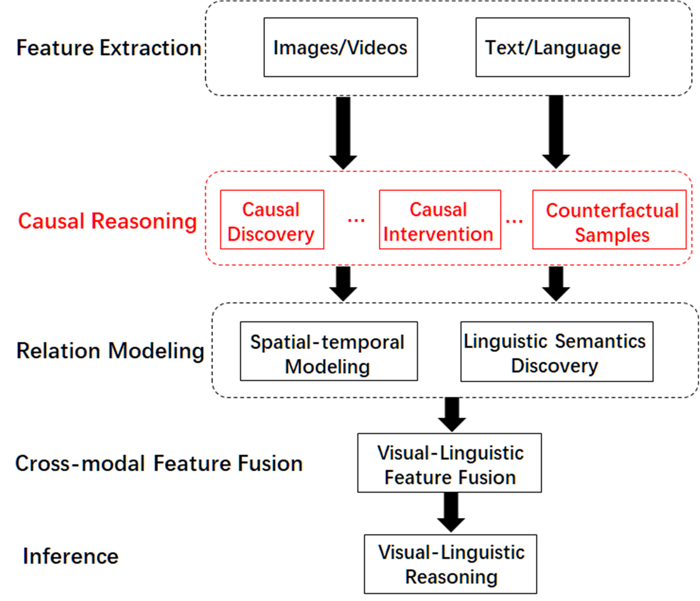

# Causal-VLReasoning
Visual-Linguistic Causal Learning Open-source Framework

Causal-VLReasoning is a python open-source framework for causal discovery that implements state-of-the-art causal discovery algorithms for visual-linguistic reasoning, such as VQA, Image/Video Captioning, Medical Report Generation, etc. 

The framework is actively being developed. Feedbacks (issues, suggestions, etc.) are highly encouraged.

# Framework Overview

        
Figure 1: Framework of Causal-VLReasoning.

Our Causal-VLReasoning implements methods for visual-linguistic causal learning:

* VQA.
* Image/Video Captioning.
* Medical Report Generation.
* General causal representation learning.
* General causal discovery methods.
* Multiple utilities for building your own method, such as independence tests, score functions, graph operations, and evaluations.

# Install

Causal-VLReasoning needs the following packages to be installed beforehand:

* python 3
* numpy
* networkx
* pandas
* scipy
* scikit-learn
* statsmodels
* pydot
* pytorch

(For visualization)

* matplotlib
* graphviz

To use Causal-VLReasoning, we could install it using [pip](https://pypi.org/project/Causal-VLReasoning/):

```
pip install Causal-VLReasoning
```


# Documentation

Please kindly refer to [Causal-VLReasoning Doc](https://github.com/YangLiu9208/Causal-VLReasoning) for detailed tutorials and usages.

# Running examples

For causal discovery, there are various running examples in the **‘tests’** directory.

For the implemented modules, we provide unit tests for the convenience of developing your own methods.

# Exemplar Tasks and Benchmarks

### VideoQA Task  
Method:   
[Cross-Modal Causal Relational Reasoning for Event-Level Visual Question Answering](https://github.com/YangLiu9208/CMCIR)    
Benchmarks:    
[SUTD-TrafficQA](https://sutdcv.github.io/SUTD-TrafficQA/#/), [TGIF-QA](https://github.com/YunseokJANG/tgif-qa), [MSVD-QA](https://github.com/xudejing/video-question-answering) and [MSRVTT-QA](https://github.com/xudejing/video-question-answering) datasets.      

Please feel free to let us know if you have any recommendation regarding datasets with high-quality. We are grateful for any effort that benefits the development of causality community.


# Contribution

Please feel free to open an issue if you find anything unexpected.
We are always targeting to make our community better!
